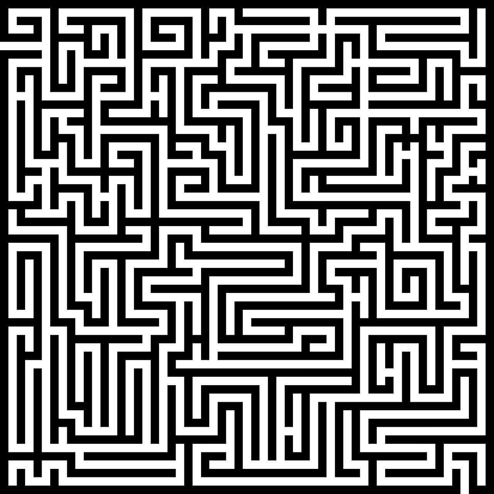

# Algorithmique des graphes


Ce dépôt à destination des L3 Informatique et Mathématiques de l'UPVD reprend le cours 

**Algorithmique avancée** du 

M1 Informatique pour la Science des Données, Université Paris-Saclay, Faculté d'Orsay

[Page web](http://nicolas.thiery.name/Enseignement/M1-ISD-AlgorithmiqueAvancee/),
[ENT eCampus](https://ecampus.paris-saclay.fr/course/view.php?name=UPSAY_2025_940_UE_O4INA12)

+++

«L’objectif de ce cours est de fournir des outils et techniques
algorithmiques de pointe aux apprentis. Étude de l’algorithmique sur
les graphes (plus courts chemins, tri topologique, …), les techniques de
mémorisation, de programmation dynamique et de backtracking.
Présentation de la notion de flots et des algorithmes de calcul de flot
maximal. Enfin, les thèmes des algorithmes online et approchés seront
abordés.»

+++

## Enseignants 

- [Florent Hivert](https://www.lri.fr/~hivert/) (pas cette année)
- [Viviane Pons](https://www.lri.fr/~pons/en/) (pas cette année)
- [Nicolas M. Thiéry](http://Nicolas.Thiery.name)

### Enseignant pour l'UPVD

- [Philippe Langlois](http://perso.univ-perp.fr/langlois)

+++

## Vue d'ensemble

+++

Les notions du cours seront abordées par la pratique, tout d'abord par
l'implantation de structures de données de graphes, puis leur
utilisation pour résoudre quatre problèmes.

+++

### Structures de données pour les graphes

+++

### 
Problème 1: Le chemin le plus rapide en métro de Montgallet à Billancourt ?

:::{figure} media/metro-paris.gif
:width: 50%
:::

+++

### Problème 2: [Rush Hour](http://www.thinkfun.com/products/rush-hour/)

La voiture rouge est coincée dans un embouteillage; comment déplacer les véhicules pour la faire sortir?
Ci-dessous le défi 1. Saurez-vous faire résoudre par l'ordinateur le défi 40 en un nombre minimum du coups?

:::{figure} media/rush_hour.gif
:alt: Un visuel du jeu de plateau RushHour
:::

+++

### Problème 3: Faire passer le maximum de courant

:::{figure} media/reseau-electrique.png
:width: 50%
:::

+++

### Problème 4: Fabriquer et résoudre des labyrinthes

<center>



</center>

+++

## Planning

+++

12 séances de 3h: Cours ou cours + TD + TP intégré

mercredi 14h-17h

+++

### Graphes: structures de données, terminologie, plus courts chemins

- 2026-09-09
  2026-09-16 (+ test Python)

+++

### Arbres couvrants

+++

### Parcours et plus court chemin

+++

### Réseaux et flots

+++

### CC et CT 

Semaine des examens

<!--
Tri topologique, ordonnancement simple (UET, 1 ou infinté processeurs)

Arbre, labyrithes, arbre couvrant de poids minimal algos Kruskal puis Prim.

Réseaux: Dijkstra, flots, Ford-Fulkerson, ...

Article de Mathieu Gay Paquet
!-->

+++

## Modalités d'évaluation

L'évaluation se fera sur vos TPs, évalués à l'oral (CC), ainsi que sur un examen (CT)

Note UE : 1/2 CC + 1/2 CT

+++

### Annales

Désolé, je n'en n'ai pas encore.

+++

## Du bon usage des aides

:::{attention} 

Vous avez à disposition de multiples aides: enseignant, solutions en
ligne, collègues, copains, famille, robots conversationnels, etc.

**Vous êtes responsables de votre progression, à vous de les utiliser
à bon escient.**

:::

+++

:::{admonition} Nos conseils
:class: tip

- Les exercices de ce cours sont à réaliser par vous-même pour qu'ils
  soient utiles à votre progression. Copier ou simplement adapter une
  solution existante ne vous apportera pas grand chose.
- Si, après un temps de réflexion personnelle approfondie, vous ne
  voyez pas comment avancer, alors n'hésitez pas à demander **des
  indications** à vos aides.  
  Si vous vous adressez à un robot conversationnel, soyez précis dans
  votre invite (prompt): «Vous êtes un enseignant bienveillant d'un
  cours de master d'algorithmique de graphes. Je dois résoudre
  l'exercice suivant: ... J'ai essayé ... Sans me donner la solution,
  pourriez vous me donner une indication sur comment avancer à partir
  de là?»
- Vous pouvez aussi utiliser vos aides pour discuter vos solutions aux
  exercices.
- Privilégiez les conversations avec des humains; elles sont plus
  fécondes qu'avec un robot.  
  **Vous êtes aussi responsable de votre impact environnemental**

:::

+++

:::{admonition} Évaluation des TPs
:class: hint

Vous ne serez pas évalués sur vos rendus de TP, mais lors de deux ou
trois mini-oraux portant sur le thème des TPs.

Motivation:
- Vous inciter à **comprendre** les TPs plus qu'à les **remplir**.
- Consacrer mon temps de correction des TPs à des dialogues individuel
  féconds, plutôt qu'à faire le flic et compter des points derrière
  mon ordi.
- Vous faire remémorer vos TPs après la fin de ceux-ci, pour aider à
  ancrer les apprentissages sur le plus long terme.

:::

+++

## Environnement de travail

- Langage de programmation: Python 3
- Bibliothèques: networkx + matplotlib + ...
- Environnement interactif: [Jupyter](https://jupyter.org)
- Forge logicielle: GitHub

+++

Dans cette section, nous expliquons:
- Comment accéder aux logiciels requis
- Comment télécharger et déposer vos devoirs

Les instructions font l'hypothèse que vous travaillerez sur ce cours dans votre
répertoire `~/L3-AlgoGraphes`. Vous pouvez choisir un autre nom.

+++

### Accéder aux logiciels requis

Ce cours utilise Python, Jupyter et quelques bibliothèques classiques (voir le
fichier [pyproject.toml](pyproject.toml), ainsi que quelques paquets Python plus ou
moins maison.

:::{admonition} Utilisation des logiciels en ligne (pas disponible à l'UPVD)

L'université Paris-Saclay mets à votre disposition un service sur lequel sont installés
tous les logiciels requis. Vous pouvez vous identifier avec vos identifiants usuels de
l'université (Adonis).

1. Ouvrez le <a href="https://mydocker.universite-paris-saclay.fr/shell/join/ObaNNeSqPTtSjEGJLekO/user-redirect/git-pull?repo=https%3A%2F%2Fgitlab.dsi.universite-paris-saclay.fr%2FM1InfoISDAlgorithmiqueAvancee%2FComputerLab%2F&targetPath=M1-ISD%2FAlgorithmiqueAvancee&urlpath=lab%2Ftree%2FM1-ISD%2FAlgorithmiqueAvancee%2Ftableau_de_bord.md%3Freset" target="_blank">tableau de bord du cours</a>

:::

::::{admonition} Installation en local de l'environnement de travail
:class: dropdown

Alternativement, vous pouvez installer les logiciels sur votre machine et travailler en
local.

::::{admonition} Instructions d'installation avec `uv`
:class: dropdown tip

1. Si vous ne l'avez pas déjà fait, installez le gestionnaire d'environnements
   [uv](https://docs.astral.sh/uv/getting-started/installation/).

2.  Si vous ne l'avez pas déjà fait, téléchargez la «salle de TP virtuelle» :

    ```
    git clone https://gitlab.dsi.universite-paris-saclay.fr/M1InfoISDAlgorithmiqueAvancee/ComputerLab.git ~/M1-ISD/AlgorithmiqueAvancee
    ```

3. Allez dans le dossier contenant le matériel pédagogique et lancez JupyterLab. Les
   logiciels requis seront automatiquement installés dans ce dossier.

   ```
   cd ~/M1-ISD/AlgorithmiqueAvancee
   uv run jupyter lab tableau_de_bord.md
   ```

La liste des logiciels pourra être mise à jour en en cours de semestre. Dans ce cas:

    cd ~/M1-ISD/AlgorithmiqueAvancee
    git pull
    uv sync

:::

% :::{admonition} Avec Docker
%  
% Une image docker du cours est fournie dans le
% [Container Registry](https://gitlab.dsi.universite-paris-saclay.fr/M1InfoISDAlgorithmiqueAvancee/ComputerLab/container_registry)
% du projet Gitlab du cours. Voici son identifiant:
%  
%     gitlab.dsi.universite-paris-saclay.fr:5005/m1infoisdalgorithmiqueavancee/computerlab/image:latest
%  
% :::

::::

+++

### TODO UPVD  Télécharger et déposer les devoirs

Le matériel pédagogique de ce cours est réparti sous la forme de devoirs que vous
téléchargerez depuis le tableau de bord. Par exemple, lors de la première séance, vous
téléchargerez le devoir 1-StructuresDeDonnees et suivrez les instructions dans les
feuilles successives `README.md`, `00-*.md`, `01-*.md`, ... ainsi que `Rapport.md`.

Depuis le tableau de bord, vous pouvez déposer votre travail aussi souvent que vous le
souhaitez. Cela permet d'en avoir une sauvegarde et de le rendre disponible à vos
enseignants et éventuellement votre binôme.

Depuis le tableau de bord, vous pouvez aussi accéder au devoir et à votre dépôt, par
exemple pour en consulter l'historique.

:::{admonition} Pour en savoir plus

Chaque devoir est publié sous la forme d'un dépôt git sur la [forge logicielle GitLab de
l'université](https://gitlab.dsi.universite-paris-saclay.fr). Télécharger le devoir
revient à en faire une copie locale (clone) ou la mettre à jour (pull) si elle existe
déjà. Déposer revient à créer une divergence privée (*fork*) ou de la mettre à jour si
elle existe déjà (push)

:::

+++

#### 

Consultation des résultats des tests automatiques

Vous pouvez consulter les résultats des tests automatiques en navigant sur votre dépôt
depuis le tableau de bord.  Quelques minutes après avoir déposé, un badge apparaîtra
avec votre score. Cliquez dessus et suivez les liens pour consulter le résultat de la
correction automatique.

+++

#### Travail en binôme

Les TP seront à effectuer en binôme. Vous trouverez sur 
[cette page web](https://nicolas.thiery.name/Enseignement/Info111/collaboration.html)
des suggestions sur comment travailler en binôme, et notamment
configurer vos dépôts sur GitLab pour faciliter la collaboration et la
correction.
